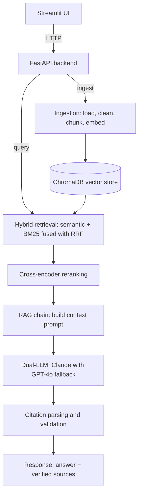

# RAG Pipeline Production

[](https://github.com/dennisdarko0101/rag-pipeline-production/actions/workflows/ci.yml)
[](https://github.com/dennisdarko0101/rag-pipeline-production/actions/workflows/cd.yml)
[](https://github.com/dennisdarko0101/rag-pipeline-production/actions/workflows/eval.yml)
[](https://www.python.org/downloads/)
[](LICENSE)
[]()
[](https://github.com/astral-sh/ruff)

A Retrieval-Augmented Generation system built from scratch in Python. It combines hybrid search (semantic plus BM25), cross-encoder reranking, and dual-LLM generation with automatic fallback to produce answers that are grounded in your documents and backed by citations you can check.

This README is written to teach. If you have never built a RAG system, you can read it top to bottom and understand both how each stage works and why it was built that way. If you just want to run it, jump to [Quick Start](#quick-start).

## What problem this solves

A large language model knows only what was in its training data. Ask it about your internal docs, a recent paper, or a private knowledge base and it will either refuse or, worse, make something up that sounds correct. That second failure mode is the dangerous one.

Retrieval-Augmented Generation fixes this by changing the order of operations. Instead of asking the model to answer from memory, you first retrieve the most relevant passages from a document collection, then hand those passages to the model and ask it to answer using only what you gave it. The model stops being a memory bank and becomes a reasoning layer on top of evidence you control.

That shift buys three things that matter in production:

- **Freshness.** Add a document and it is answerable immediately. No retraining.
- **Grounding.** Answers point back to specific sources, so a reader can verify them.
- **Control.** You decide what the model is allowed to see, which keeps it on-topic and reduces invented facts.

The hard part is not calling an LLM. The hard part is retrieving the *right* passages, ranking them well, keeping the model honest about its sources, and knowing whether the whole thing is actually any good. That is what this project is about.

## Architecture



Two paths run through the same system. The **ingest** path turns raw documents into searchable vectors stored in ChromaDB. The **query** path retrieves from that store, reranks, generates an answer, and validates the citations before returning it.

## How it works

Each stage below explains what it does, why it exists, and the trade-off behind the design choice. The full reasoning lives in [docs/ARCHITECTURE.md](docs/ARCHITECTURE.md); the key points are surfaced here so this README stands on its own.

### 1. Ingestion: turning documents into clean text

Loaders read PDFs (page by page with pypdf), Markdown, plain text, and web pages (fetched with httpx, stripped of navigation and scripts with BeautifulSoup). Everything becomes one universal `Document` type so the rest of the pipeline never has to care where the text came from.

A preprocessing pass then normalizes Unicode, collapses whitespace, extracts titles and dates, and computes a SHA-256 fingerprint of the normalized text. Documents with a duplicate fingerprint are dropped.

**Why fingerprint and dedup?** The same content often arrives twice (a re-upload, a mirrored page). Duplicate chunks waste storage, slow retrieval, and let one source dominate the results. Hashing the normalized text catches duplicates even when formatting differs.

### 2. Chunking: splitting text into retrievable pieces

Documents are split into smaller chunks (512 characters by default, with overlap). The default `RecursiveChunker` wraps LangChain's splitter and breaks on a hierarchy of separators (paragraphs, then lines, then sentences, then words) so it cuts at natural boundaries instead of mid-word. A `SemanticChunker` is also available; it groups sentences by embedding similarity and starts a new chunk when the topic shifts.

**Why chunk at all, and why this size?** Embeddings represent a fixed-length vector regardless of input length, so a whole document compresses into one blurry point that matches everything weakly and nothing well. Smaller chunks give sharper, more specific matches. The trade-off is granularity versus context: chunks too small lose the surrounding meaning, too large dilute the signal. Around 512 characters with overlap keeps each chunk focused while the overlap prevents an answer from being split across a boundary.

### 3. Embedding: turning text into vectors

Each chunk is sent to OpenAI's `text-embedding-3-small` model, which returns a 1536-dimension vector. Texts are batched (100 per call), token-counted with tiktoken, and truncated if they exceed the model limit. A file-based cache keyed on SHA-256 of the model name plus text sits in front of the API.

**Why cache embeddings?** Embedding is deterministic: the same text always produces the same vector. Re-embedding unchanged text on every re-ingest is wasted money and latency. The cache turns a repeat ingest into a local file read. The trade-off is disk usage, which is bounded by an optional TTL.

### 4. Storage: ChromaDB

Vectors and their metadata are upserted into ChromaDB, which runs as an embedded library with persistent file storage and indexes vectors with HNSW for fast approximate nearest-neighbor search.

**Why ChromaDB?** It needs zero separate infrastructure to run locally, which keeps the project easy to clone and start. The code talks to it through a small `VectorStore` interface with four methods, so moving to a managed store like Pinecone, Qdrant, or Weaviate for large-scale production means implementing that interface, not rewriting the pipeline. The trade-off is that embedded Chroma is single-process and not built for very large collections, which is exactly why the interface exists.

### 5. Hybrid retrieval: semantic plus keyword

When a query arrives, two retrievers run in parallel:

- **Semantic retriever** embeds the query and finds the nearest chunk vectors. It understands meaning, so "ML" can match "machine learning."
- **BM25 retriever** scores chunks by keyword overlap using the Okapi BM25 algorithm. It catches exact terms that embeddings smooth over, like error codes, function names, or rare proper nouns.

Each returns a generous candidate set (three times the requested count) and the two ranked lists are merged with Reciprocal Rank Fusion.

**Why use both?** Pure semantic search misses exact matches; pure keyword search misses paraphrases. Real queries need both. Running them together and fusing the results captures the strengths of each. The cost is a second retrieval path to maintain, which is cheap because BM25 runs in memory in a few milliseconds.

### 6. Reciprocal Rank Fusion: combining two ranked lists

RRF scores each document by `sum over retrievers of weight / (k + rank)`, with `k = 60` and default weights of 0.7 for semantic and 0.3 for keyword. Documents are then deduplicated and sorted by the fused score.

**Why RRF instead of averaging scores?** Semantic similarity scores and BM25 scores live on completely different scales. Averaging them directly means whichever retriever happens to produce larger numbers wins, which has nothing to do with relevance. RRF ignores the raw scores and uses only rank position, so it does not care about scale at all. The constant `k = 60` comes from the original RRF paper and keeps the top few results from dominating. The weights let you tilt toward meaning or exact matching without touching the rest of the system.

### 7. Reranking: a slower, sharper second pass

The fused candidates go through a cross-encoder (`ms-marco-MiniLM-L-6-v2`), which scores each query-and-document pair together and keeps the top results.

**Why a second model?** Retrieval embeds the query and the documents separately, then compares the vectors. That is fast because document vectors are precomputed, but the query never actually "sees" the document during scoring. A cross-encoder runs the query and document through the model together, so every query word can attend to every document word. That is far more accurate for subtle relevance judgments. The catch is speed: it cannot precompute anything, so it runs per pair at query time. The pipeline gets the best of both by using fast retrieval to narrow thousands of chunks down to a handful, then spending the cross-encoder's effort only on those. The model loads lazily, so if reranking is turned off it never loads at all.

### 8. Generation: dual-LLM with fallback

The reranked chunks are formatted into a numbered context block and sent to the LLM with a system prompt that instructs it to answer only from the provided context and to cite its sources. The primary model is Claude 3.5 Sonnet; if the Anthropic API fails, `FallbackLLM` automatically retries with GPT-4o. Both providers share one `BaseLLM` interface, both retry with exponential backoff, and both track token usage.

**Why two providers?** APIs have outages, and a portfolio system that goes dark when one vendor has a bad day is not production-grade. Fallback keeps answers flowing. The fallback rate is tracked, so a sudden spike is a signal to investigate the primary provider rather than a silent degradation. The cost is the operational overhead of holding two API keys.

### 9. Citation validation: keeping the model honest

Even when told to cite only from the context, models sometimes invent a source. After generation, the response parser extracts every `[Source: file, chunk N]` citation with a regex, checks each one against the set of documents that were actually retrieved, and strips any citation that does not match a real source.

**Why bother?** A citation a reader cannot trust is worse than no citation, because it manufactures false confidence. Validating against the retrieved set guarantees that every reference left in the final answer points to a document the system genuinely used. This is the step that turns "sounds right" into "checkable."

### 10. Evaluation: knowing whether it actually works

A RAG system can pass every unit test and still give bad answers. The evaluation framework measures answer quality directly using an LLM as a judge, scoring four metrics from 0.0 to 1.0:

- **Faithfulness:** are the answer's claims supported by the retrieved context?
- **Answer relevancy:** does the answer actually address the question?
- **Context precision:** were the retrieved contexts relevant?
- **Context recall:** did the context contain the information needed?

It runs against a golden dataset of 18 question-and-answer pairs spread across four categories (straightforward, multi-chunk, unanswerable, and adversarial), so it tests not just easy lookups but also questions that span several chunks and questions the system should refuse to answer. Faithfulness and answer relevancy have CI thresholds; the other two are monitored.

**Why evaluate this way?** Retrieval quality and generation quality fail differently, and a single accuracy number hides which one broke. Separating the four metrics tells you whether a regression came from retrieval (low context precision or recall) or from the model (low faithfulness or relevancy). Including unanswerable and adversarial questions checks that the system declines gracefully instead of confidently inventing an answer, which is where naive RAG systems quietly fail.

## Quick Start

```bash
# 1. Clone and install
git clone https://github.com/dennisdarko0101/rag-pipeline-production.git
cd rag-pipeline-production
pip install -e ".[dev]"

# 2. Configure
cp .env.example .env    # Add your ANTHROPIC_API_KEY and OPENAI_API_KEY

# 3. Seed and run
make seed               # Load sample docs into ChromaDB
make run                # API at http://localhost:8000
make run-ui             # UI at http://localhost:8501 (separate terminal)
```

### Docker (one command)

```bash
make docker-build && make docker-up
```

This starts the API (`:8000`), ChromaDB (`:8001`), and the Streamlit UI (`:8501`) with health-check dependencies and network isolation between the backend and frontend.

## API Reference

| Method | Endpoint | Description |
|--------|----------|-------------|
| `POST` | `/api/v1/query` | Run the full RAG pipeline (retrieve, rerank, generate) |
| `POST` | `/api/v1/ingest` | Ingest a document from a file path or URL |
| `POST` | `/api/v1/ingest/upload` | Upload and ingest a file (PDF, MD, TXT) |
| `POST` | `/api/v1/evaluate` | Evaluate RAG quality against Q&A pairs |
| `GET`  | `/health` | Component-level health check |

Interactive docs are served at `http://localhost:8000/docs`.

```bash
# Example: query the pipeline
curl -X POST http://localhost:8000/api/v1/query \
  -H "Content-Type: application/json" \
  -d '{"question": "What is retrieval-augmented generation?", "k": 10, "rerank": true}'
```

## Streamlit Dashboard

The UI talks to the backend only over HTTP (no internal imports), the same way any external client would. It provides:

- **Chat tab:** a conversational interface with expandable source cards and per-stage pipeline timing.
- **Evaluation tab:** run the golden-dataset evaluation and view color-coded metric cards plus per-question results.
- **Sidebar:** LLM provider selection, retrieval and reranking controls, live system health, and document ingestion.

Because the boundary is HTTP only, the Streamlit front end could be replaced with React or Next.js without changing a line of backend code.

## Evaluation

Four LLM-as-judge metrics, each scored 0.0 to 1.0 with an explanation:

| Metric | What it measures | CI threshold |
|--------|-----------------|-------------|
| **Faithfulness** | Are claims supported by the retrieved context? | >= 0.70 |
| **Answer Relevancy** | Does the answer address the question? | >= 0.70 |
| **Context Precision** | Are the retrieved contexts relevant? | Monitored |
| **Context Recall** | Is the needed information present in the context? | Monitored |

The golden dataset holds 18 Q&A pairs across four categories: straightforward, multi-chunk, unanswerable, and adversarial. A weekly GitHub Actions job runs the evaluation and opens an issue if quality drops below the thresholds.

```bash
make eval    # Run evaluation locally
```

See [docs/EVALUATION.md](docs/EVALUATION.md) for the full methodology.

## Tech Stack

| Layer | Technology | Purpose |
|-------|-----------|---------|
| **API** | FastAPI + Uvicorn | Async HTTP server with OpenAPI docs |
| **Vector DB** | ChromaDB | Persistent vector storage with HNSW indexing |
| **Embeddings** | OpenAI text-embedding-3-small | 1536-dim dense vectors with tiktoken counting |
| **LLM** | Claude 3.5 Sonnet + GPT-4o | Dual-LLM with automatic fallback |
| **Sparse retrieval** | rank-bm25 | Okapi BM25 keyword matching |
| **Reranking** | sentence-transformers | Cross-encoder ms-marco-MiniLM-L-6-v2 |
| **Chunking** | LangChain text splitters | Recursive character and semantic chunking |
| **PDF parsing** | pypdf | Page-level text extraction |
| **UI** | Streamlit | Interactive dashboard with a dark theme |
| **Config** | Pydantic Settings | Type-safe configuration from `.env` |
| **Logging** | structlog | Structured JSON logging with context |
| **Testing** | pytest | 279 tests, 80%+ coverage required |
| **Linting** | ruff + mypy | Fast linting and strict type checking |
| **CI/CD** | GitHub Actions | Lint, test, security scan, Docker push |
| **Containers** | Docker + Compose | Multi-stage builds, three-service stack |

## Project Structure

```
rag-pipeline-production/
├── src/
│   ├── api/                        # FastAPI application
│   │   ├── main.py                 #   App entry point, CORS, lifecycle
│   │   ├── schemas.py              #   Pydantic request/response models
│   │   ├── routes/                 #   query, ingest, evaluate, health
│   │   └── middleware/             #   Rate limiting, request logging
│   ├── ingestion/                  # Document loading, chunking, preprocessing
│   ├── embeddings/                 # OpenAI embedder and file-based cache
│   ├── vectorstore/                # ChromaDB implementation and interface
│   ├── retrieval/                  # Semantic, BM25, hybrid retrievers and rerankers
│   ├── generation/                 # LLM abstraction, RAG chain, citation parser
│   ├── evaluation/                 # Metrics, dataset, runner, report comparison
│   ├── config/                     # Pydantic Settings
│   ├── models/                     # Universal Document model
│   └── utils/                      # Structured logging, Prometheus metrics
├── tests/
│   ├── unit/                       # 263 unit tests (all external APIs mocked)
│   ├── integration/                # 16 integration tests
│   └── eval/                       # Golden dataset (18 Q&A pairs)
├── ui/                             # Streamlit dashboard
│   ├── app.py                      #   Main app (chat and eval tabs)
│   ├── api_client.py               #   httpx client for the backend
│   ├── components.py               #   Metric cards, source cards, timeline
│   └── config.py                   #   Theme, API URL, page settings
├── docker/
│   ├── Dockerfile                  # Multi-stage API build (non-root user)
│   ├── Dockerfile.ui               # Lightweight UI build
│   └── docker-compose.yml          # Three-service stack with network isolation
├── .github/workflows/
│   ├── ci.yml                      # Lint, type-check, test, security scan
│   ├── cd.yml                      # Docker build and push to ghcr.io
│   └── eval.yml                    # Scheduled evaluation and quality gates
├── docs/                           # Architecture, deployment, evaluation
├── scripts/                        # setup.sh, seed_db.sh, run_eval.sh
├── data/sample_docs/               # 4 technical articles for testing
├── pyproject.toml                  # Dependencies and tool configuration
├── Makefile                        # All development commands
├── .dockerignore                   # Docker build exclusions
├── CONTRIBUTING.md                 # Contributing guidelines
└── LICENSE                         # MIT
```

## Testing

```bash
make test           # Run all 279 tests
make test-cov       # Run with an HTML coverage report (80%+ required)
make eval           # Run RAG evaluation against the golden dataset
```

All external APIs (OpenAI, Anthropic, ChromaDB) are mocked, so no API keys are needed to run the test suite.

**Breakdown:** 263 unit tests plus 16 integration tests covering loaders, chunkers, the embedder, the cache, retrievers (including the shared BM25 index), rerankers, the LLM layer, prompts, the RAG chain, every API endpoint, the evaluation metrics, dataset, and runner, and full request-to-response cycles.

## CI/CD

| Workflow | Trigger | Jobs |
|----------|---------|------|
| **CI** | Push/PR to `main` | Lint, type-check, test (Python 3.11 and 3.12), security scan |
| **CD** | Push to `main` | Build and push Docker images to `ghcr.io` |
| **Eval** | Weekly and manual | RAG quality evaluation with threshold checks, opens an issue on degradation |

## Configuration

All settings come from environment variables (`.env`), loaded through Pydantic Settings:

| Variable | Default | Description |
|----------|---------|-------------|
| `ANTHROPIC_API_KEY` | | Claude API key |
| `OPENAI_API_KEY` | | OpenAI API key (embeddings and GPT-4o fallback) |
| `LLM_MODEL` | `claude-3-5-sonnet-20241022` | Primary LLM |
| `LLM_FALLBACK_MODEL` | `gpt-4o` | Fallback LLM |
| `EMBEDDING_MODEL` | `text-embedding-3-small` | Embedding model |
| `CHUNK_SIZE` | `512` | Characters per chunk |
| `RETRIEVAL_TOP_K` | `10` | Documents to retrieve |
| `RERANK_TOP_K` | `5` | Documents to keep after reranking |
| `CHROMA_PERSIST_DIR` | `./data/chroma` | ChromaDB storage path |
| `RATE_LIMIT_REQUESTS` | `60` | Requests per rate-limit window |
| `LOG_LEVEL` | `INFO` | Logging level |

See [docs/DEPLOYMENT.md](docs/DEPLOYMENT.md) for the complete reference.

## Documentation

- [Architecture](docs/ARCHITECTURE.md): system design, data-flow diagrams, and the reasoning behind every design decision.
- [Deployment](docs/DEPLOYMENT.md): local setup, Docker, environment variables, and a cloud guide.
- [Evaluation](docs/EVALUATION.md): metrics, the golden dataset, CI integration, and the Python API.

## Contributing

See [CONTRIBUTING.md](CONTRIBUTING.md) for development setup and guidelines.

## License

[MIT](LICENSE)
